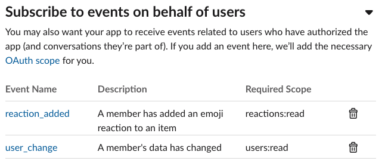

# slack-event-subscriptions


<!-- ABOUT THE PROJECT -->
## About The Project

Do you want to get simple attendance checks? If you are using Slack, participants can just react on a specific post, then we can check the attendance based on the reaction. It's so simple and fun.


### Built With
If you are not familiar with the libraries below, please read the documentation for the links below before getting started.

* [Zappa](https://github.com/Miserlou/Zappa)
* [Flask](https://github.com/pallets/flask)
* [Slack Events API for Python](https://github.com/slackapi/python-slack-events-api)


<!-- GETTING STARTED -->
## Getting Started


### Prerequisites


* Python3 (below 3.9, Zappa doesn't support 3.9 yet)
* [AWS credentials](https://aws.amazon.com/blogs/security/a-new-and-standardized-way-to-manage-credentials-in-the-aws-sdks/)
* Slack App
    1. Create the new app from [https://api.slack.com/apps](https://api.slack.com/apps).<br/>
    
    2. Copy the signing secret.<br/>
    
    3. Add an OAuth scope (`users.profile:read`) and install to work space.<br/>
    <br/>
    <br/>
    4. Copy the OAuth Access Token.<br/>
    
### Installation


1. Clone the repo
   ```sh
   git clone https://github.com/UpstageAI/slack-event-subscriptions.git
   ```
1. Install Python packages
   ```sh
   cd slack-event-subscriptions
   pip install -r requirements.txt
   ```
1. Init Zappa
   ```sh
   zappa init
   ```
1. Update the `zappa_settings.json` like the example below.
    - (REQUIRED) `aws_region`, `REGION_NAME` : AWS region for your services
    - (REQUIRED) `SLACK_SIGNING_SECRET` :  Siging secret of your slack app
    - (REQUIRED) `SLACK_OAUTH_TOKEN` :  Oauth token of your slack app
    - (REQUIRED) `TABLE_NAME` : Table name for DynamoDB
    - (OPTIONAL) `SLACK_CHECK_CHANNEL` : Specific channel id for the event subscription. (if it's empty, you will get the events from all channels.)
    - (OPTIONAL) `KEY_WORD` : In case you want to filter some users based on their name.
   ```json
   ###Example for `zappa_settings.json`

    {
        "dev": {
            "app_function": "app.app",
            "aws_region": "ap-northeast-2",
            "profile_name": null,
            "project_name": "slack-event-sub",
            "runtime": "python3.8",
            "s3_bucket": "zappa-ih029w3pa",
            "environment_variables": {
                "SLACK_SIGNING_SECRET": "<YOUR_SLACK_SIGNING_SECRET>",
                "SLACK_OAUTH_TOKEN": "<YOUR_SLACK_OAUTH_TOKEN>",
                "SLACK_CHECK_CHANNEL":"XXXXXXXXXXX",
                "REGION_NAME": "ap-northeast-2",
                "TABLE_NAME":"slack_attendance_check",
                "KEY_WORD":""
            }
        }
    }
   ```
1. Deploy the app and copy the endpoint from the output
    ```sh
    zappa deploy dev
    ```
    ```
    ...
    Waiting for stack slack-event-sub2-dev to create (this can take a bit)..
    50%|███████████████████████████████████████████████                                               | 2/4 [00:09<00:09,  4.90s/res]
    Deploying API Gateway..
    Deployment complete!: https://eycl36fqk9.execute-api.ap-northeast-2.amazonaws.com/dev
    ```
1. Create the tables (for the first time)
    ```sh
    zappa invoke dev 'from db import create_table;create_table()' --raw
    ```
1. Update the configurations for slack app.
    1. Enable events by adding `<YOUR_ENDPOINT_URL>/slack/events`<br/>
    
    2. Add workspace event `reaction_added`<br/>
    
1. Save and reinstall your app.
<!-- USAGE EXAMPLES -->
## Usage

Once you finish the setting, post the sample message in your slack channel and add a reaction.<br/>


Then, you can find two tables from your DynamoDB.<br/>

 the shorter name one is the table for the event storing <br/>
 
 And, the table with a suffix `_user` is an actual organized version by the date and the name of the users.<br/>


You can also access the data via api
`<YOUR_ENDPOINT>/csv`, and it will return `csv` version.
```csv
user_id,username,z20210112
U01JH17VD19,Jungwon Seo,17:35:19
U01JH17VD20,Junglost Seo,17:36:20
U01JH17VD33,Jungdraw Seo,17:37:33
...
```
The csv api supports two query parameters `d` and `s`. 
- `d`: specific date for the list (e.g., d=20210112), if none, entire dataset will be returned.

- `s`: sorting key for the result (e.g., s='user_id`). Only ascending order supports yet.


## Ohters
- Updating the work
    ```sh
    zappa update dev
    ```
- Cleaning the work
    ```sh
    zappa invoke dev 'from db import delete_table;delete_table()' --raw
    zappa undeploy dev 
    ```


<!-- CONTRIBUTING -->
## Contributing

Contributions are what make the open source community such an amazing place to be learn, inspire, and create. Any contributions you make are **greatly appreciated**.

1. Fork the Project
2. Create your Feature Branch (`git checkout -b feature/AmazingFeature`)
3. Commit your Changes (`git commit -m 'Add some AmazingFeature'`)
4. Push to the Branch (`git push origin feature/AmazingFeature`)
5. Open a Pull Request


<!-- LICENSE -->
## License

Distributed under the MIT License. See `LICENSE` for more information.


<!-- CONTACT -->
## Contact

Jungwon Seo - wsbtgt@gmail.com

Project Link: [https://github.com/UpstageAI/slack-event-subscriptions](https://github.com/UpstageAI/slack-event-subscriptions)


